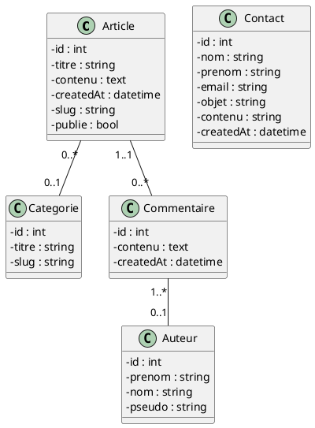

# Titre de niveau 1
## Titre de niveau 2
### Titre de niveau 3

Ceci est un texte 

**Ceci est un texte en gars**

*Ceci est un texte en italique*

***Text italique gras***

---

>**Notre :**  ceci est une note

Pour voir la documentation, cliquez [ici](documentation/documentation.md).

## Insérer du code

```php
function toto(): string{
    return "toto";
}
```

## Diagramme de classes



## Tableau

| entete1 | entete2 |
|---------|---------|
| TOTO    | TATA    |